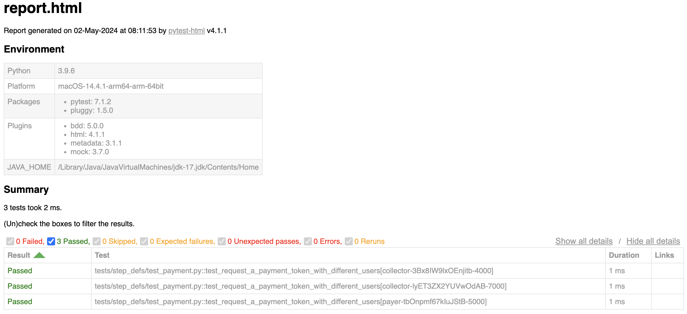

# Tokeni-Jungle-Automation

Breve descripción del proyecto.

## Configuración del Entorno

### Prerrequisitos

- Python 3.8+
- pip
- virtualenv (opcional)

### Instalación

Para instalar y configurar el entorno de desarrollo, sigue estos pasos:

```bash
# Clonar el repositorio
git clone https://github.com/usuario/mi_proyecto.git
cd mi_proyecto
```
# Configurar un entorno virtual (opcional)
```bash
python -m venv venv
source venv/bin/activate
```

# Instalar las dependencias
```bash
pip install -r requirements.txt
```


### Estructura de Carpetas para Proyecto de Pruebas con Pytest
Pytest para BDD (Desarrollo Guiado por Comportamiento), puedes seguir el siguiente esquema. Esta estructura asume que estás utilizando pytest con el plugin pytest-bdd para escribir tus pruebas BDD:
```bash
mi_proyecto/
│
├── src/                           # Directorio para el código fuente del proyecto
│   ├── __init__.py                # Hace que src sea un módulo de Python
│   ├── signature_utils.py         # Módulo para funciones de firma y ordenación
│   └── request_modifier.py        # Módulo para modificar solicitudes HTTP
│   ├── __init__.py                # Hace que src sea un módulo de Python
│   └── payment/                   # Directorio para el módulo de pagos
│   │   ├── payment.py             # Código fuente del sistema de pagos
│   │   └── ...                    # Otros archivos o directorios
│   └── ...                        # Otros módulos o archivos de Python
│
├── tests/                         # Directorio para los scripts de prueba de pytest
│   ├── step_defs/                 # Definiciones de pasos para las pruebas BDD
│   │   ├── test_payment.py        # Scripts de prueba para los escenarios de payment.feature
│   │   └── ...                    # Otros scripts de prueba
│   └── ...                        # Otros archivos o directorios de prueba
│
├── features/                      # Directorio para los archivos .feature de Payment
│   ├── payment.feature            # Archivo .feature con escenarios escritos en Payment para pagos
│   └── ...                        # Otros archivos .feature
│
├── requirements.txt               # Dependencias del proyecto
├── setup.py                       # Script de instalación para el proyecto
└── README.md                      # Documentación del proyecto

```
## Ejecución de Pruebas

Puedes ejecutar tus pruebas utilizando pytest. Por ejemplo:

```bash
    pytest --html=report.html ./tests/step_defs/test_payment.py
```

Aquí puedes encontrar el reporte de pruebas generado:


